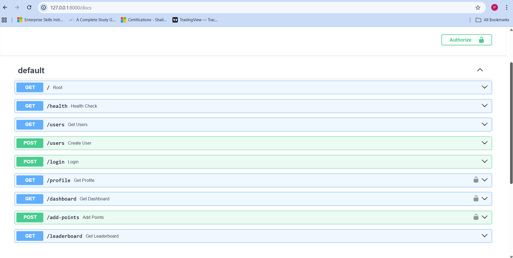
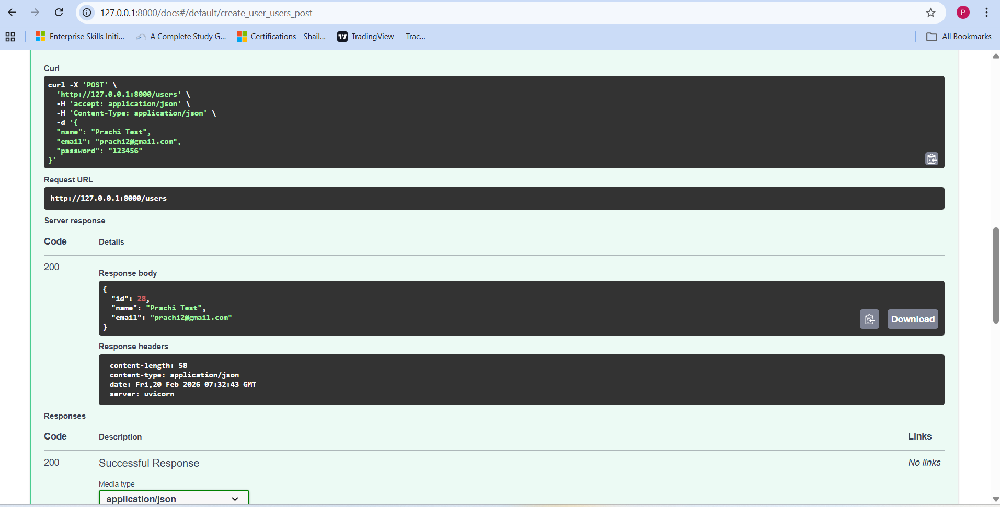
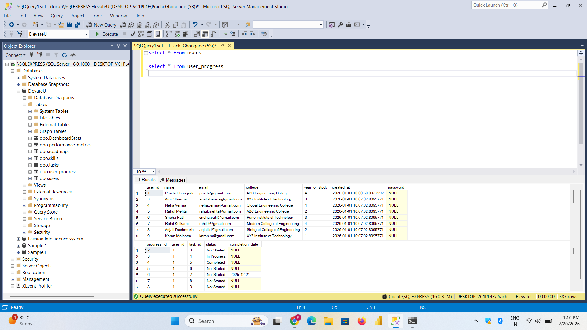

#  ElevateU – Career Analytics & Gamified Growth Platform

ElevateU is a backend-powered career analytics platform designed to help students track their learning progress, stay motivated through gamification, and improve placement readiness.

This project demonstrates REST API development using FastAPI, user authentication, progress tracking, and leaderboard functionality.

---

##  Key Features

*  User Authentication (Register & Login)
*  Progress Tracking System
*  Leaderboard with Ranking
*  Gamified Learning Approach
*  FastAPI-based high-performance backend
*  Database integration

---

## Tech Stack

* **Backend:** FastAPI
* **Database:** SQLite
* **Authentication:** JWT
* **Language:** Python
* **API Testing:** Swagger UI

---

## Project Structure

```
fastapi_test/
│
├── routers/
├── auth.py
├── database.py
├── schemas.py
├── main.py
├── requirements.txt
└── README.md
```

---

##  Installation & Setup

### 1️ Clone the repository

```bash
git clone https://github.com/PrachiGhongade26/ElevateU-Career-Analytics-System.git
cd ElevateU-Career-Analytics-System
```

### 2️ Create virtual environment

```bash
python -m venv venv
venv\Scripts\activate
```

### 3️ Install dependencies

```bash
pip install -r requirements.txt
```

### 4️ Run the server

```bash
uvicorn main:app --reload
```

---

## 📸 API Documentation

After running the server, open:

```
http://127.0.0.1:8000/docs
```

to access Swagger UI.

---

## API Preview

### 🔹 Swagger UI


### 🔹 User Registration


### 🔹 Login Success


### 🔹 Leaderboard Response


### 🔹 Database View



